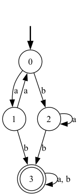

# Spacey

## ⚠️ Under Development

Spacey is an Elixir project for validating and visualizing automata. It is currently under development and provides basic functionality to generate visual representations of deterministic finite automata (DFAs) using Graphvix. The project is named after the One Piece automata *Spacey*, a loyal first lieutenant automata.

## Current Features

- **Automata Visualization:** Generate DOT and PNG files for DFAs defined by states, an alphabet, a transition table, an initial state, and final states.
- **Interactive Testing:** Quickly test your automata visualization from the IEx shell.
- **Graphical Output:** Uses Graphvix (a lightweight Elixir interface to Graphviz) for creating static images.

## Installation

If available in Hex, the package can be installed by adding `spacey` to your list of dependencies in `mix.exs`:

```elixir
def deps do
  [
    {:spacey, "~> 0.1.0"}
  ]
end
```

### Dependencies

You'll need to install Graphviz on your system:

- **Ubuntu/Debian:**

  ```shell
  sudo apt-get update
  sudo apt-get install graphviz
  ```

- **macOS (with Homebrew):**

  ```shell
  brew install graphviz
  ```

- **Windows:**
  Download and install Graphviz from [Graphviz's website](https://graphviz.org/download/), and ensure the installation directory is added to your system’s PATH.

## Usage

### In an IEx Session

Launch IEx with your project:

```shell
iex -S mix
```

Then, you can generate a DFA automata image with the following example:

```elixir
states = [0, 1, 2, 3]
alphabet = ["a", "b"]
transitions = [
  [1, 2],
  [0, 3],
  [2, 3],
  [3, 3]
]
initial_state = 0
final_states = [3]

Spacey.Automata.visualize(states, alphabet, transitions, initial_state, final_states, "my_automata")
```

This call creates the files `my_automata.dot` and `my_automata.png` in your project directory. It might look like this:



## Project Structure

- `lib/spacey.ex`: Main module with basic functions.
- `lib/spacey/automata.ex`: Module for visualizing automata using Graphvix.
- `mix.exs`: Project configuration and dependencies.
- `.formatter.exs`, `test/`: Standard Elixir project files.

## Inspiration

The project takes its name from *Spacey*, the automata from One Piece.  
Spacey is a first lieutenant automata, characterized by his military gear, loyalty, and a unique style. The character’s story—from his creation on Karakuri Island to his adventures and loyal service—has inspired the creative direction of this project.


## Future Work

- **Enhanced Validation:** Add more features for analyzing automata.
- **Extended Automata Support:** Support for non-deterministic and other types of automata.
- **Interactive Visualizations (Maybe):** Develop interactive tools for real-time automata manipulation.
